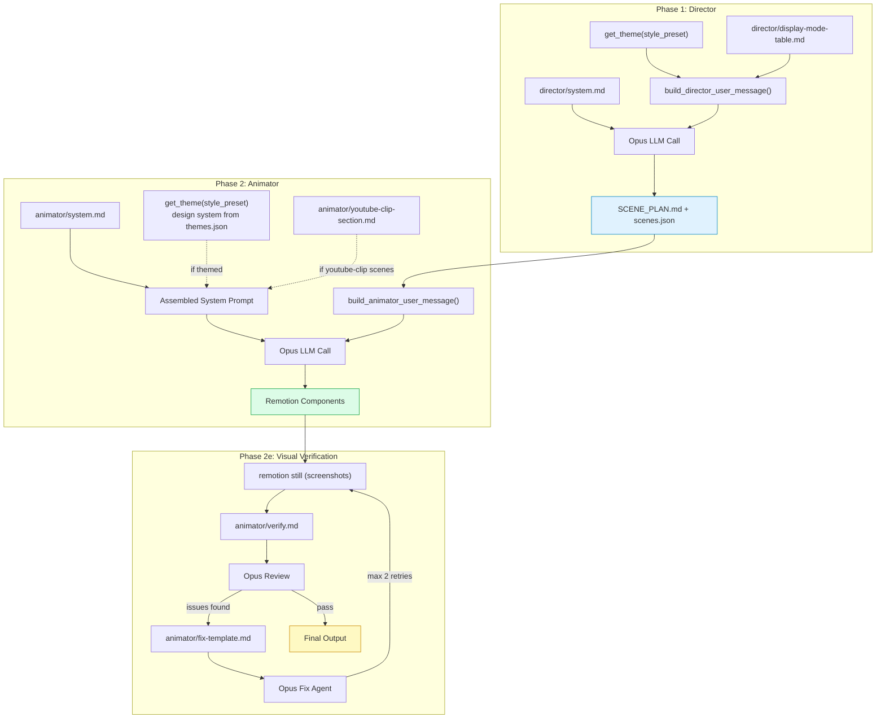
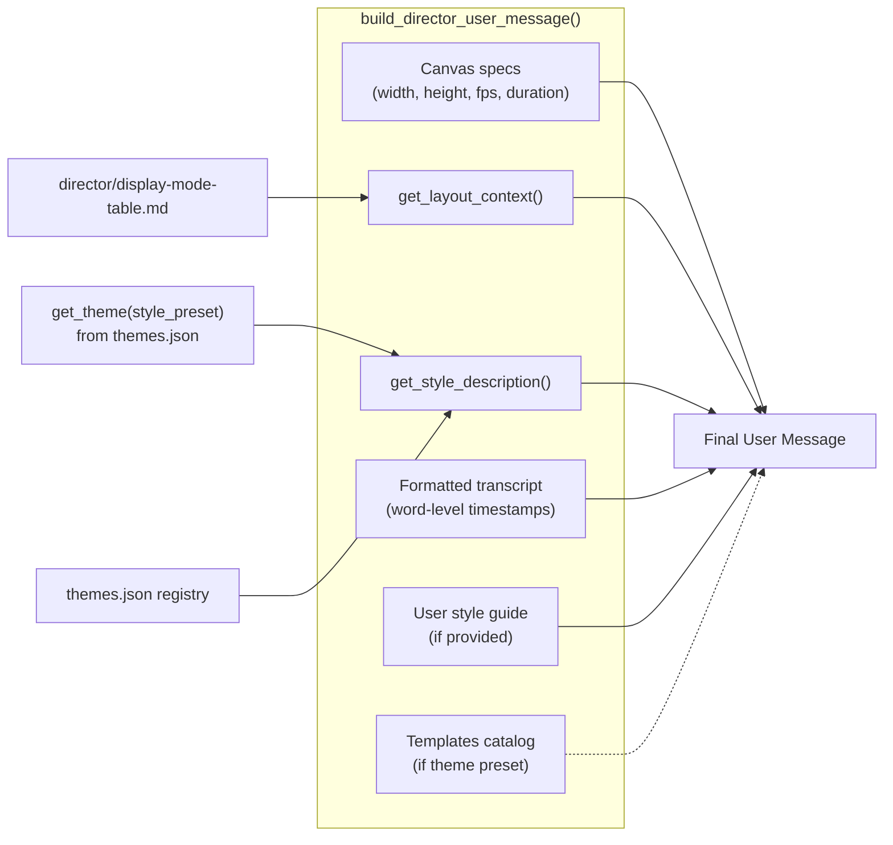
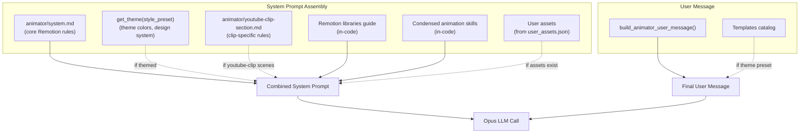
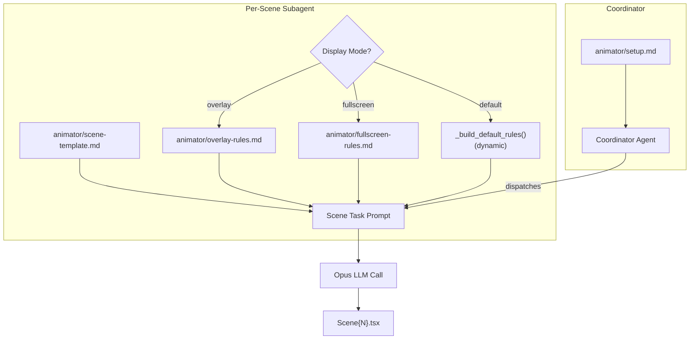
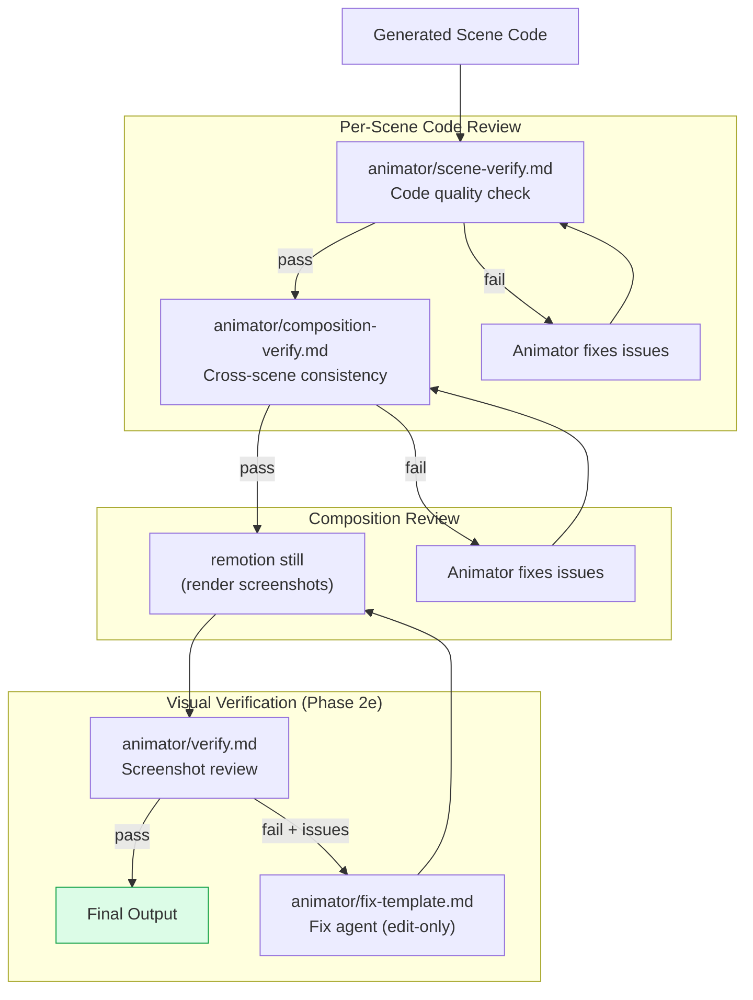
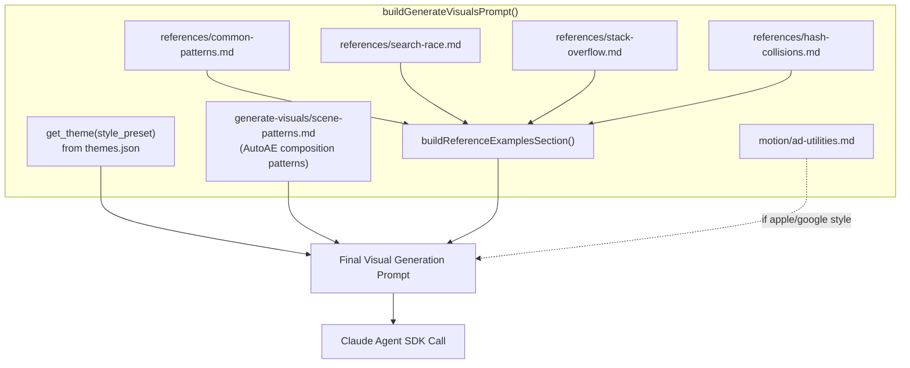

# Prompts Directory

All LLM prompt templates for the Viona video generation pipeline. Each prompt is stored as a `.md` file and loaded programmatically via `loader.ts` (TypeScript) or `loader.py` (Python).

## How It Works

```
prompts/
├── loader.ts                    # TS: loadPrompt(), loadTemplate()
├── loader.py                    # Python: load_prompt(), load_template()
├── animator/                    # Phase 2: Remotion code generation
├── director/                    # Phase 1: Scene planning
├── generate-visuals/            # TS visual generation pipeline
├── references/                  # Few-shot code examples
├── motion/                      # Animation utility snippets
├── transcribe/                  # Caption word classification
└── generate-visuals.ts          # Visual prompt builder (code, not .md)
```

### Loading Prompts

**TypeScript:**
```ts
import { loadPrompt, loadTemplate } from './loader.js';

const system = loadPrompt('animator/system');
const msg = loadTemplate('references/search-race', { projectId: 'abc123' });
```

**Python:**
```python
from prompts._loader import load_prompt, load_template

system = load_prompt('animator/system')
msg = load_template('director/user-template', transcript='...', fps=30)
```

Both loaders cache files in memory. Use `{{variable}}` syntax for template placeholders.

> **Python note:** Python prompt builders (`animator.py`, `director.py`) live alongside their `.md` files in this directory. They import via `prompts._loader` which re-exports from `loader.py`. Some prompts use Python `.format()` with `{var}` syntax — those are loaded with `load_prompt()` and formatted by the caller, not by `load_template()`.

---

## Pipeline Overview

The video generation pipeline runs through 5 phases, each using different prompts. Here's the full flow:



---

## Phase 1: Director (Scene Planning)

**Purpose:** Analyze transcript with timestamps and create a frame-accurate scene plan.

| Component | Source |
|-----------|--------|
| System prompt | `director/system.md` |
| User message | `build_director_user_message()` in `director.py` |
| Model | Opus |
| Tools | `Read`, `Write`, `Grep`, `Glob`, `WebSearch`, `TodoWrite` |
| Output | `SCENE_PLAN.md` + `scenes.json` |

### How the Director User Message Assembles



**Conditional injections:**
- `get_theme(style_preset)` — only if theme exists for the given preset
- `director/display-mode-table.md` — always included (defines overlay/fullscreen/default modes)
- Coverage tier guidance — only if source video dimensions are known

---

## Phase 2: Animator (Code Generation)

**Purpose:** Implement the Director's scene plan as Remotion TypeScript components.

The Animator has **two execution paths**:

### Path A: Monolithic (Single Agent)

Used for smaller projects. One agent implements all scenes.



### Path B: Modular (Coordinator + Per-Scene Subagents)

Used for larger projects. A coordinator dispatches per-scene agents.



**Display mode rules** control how much canvas space the scene visual occupies:

| Mode | Rules Source | Use Case |
|------|-------------|----------|
| `overlay` | `animator/overlay-rules.md` | Visual overlaid on video |
| `fullscreen` | `animator/fullscreen-rules.md` | Full-screen visual, no video |
| `default` | `_build_default_rules(ew, eh)` (dynamic) | Standard layout with computed dimensions |

---

## Phase 2 Verification (Quality Gates)

After the Animator produces code, multiple verification steps run:



| Verification Step | Prompt | Model | Tools | Max Retries |
|-------------------|--------|-------|-------|-------------|
| Scene code review | `animator/scene-verify.md` | Opus | `Read`, `Bash` | Per scene |
| Composition review | `animator/composition-verify.md` | Opus | `Read`, `Bash`, `Edit`, `Glob` | 1 |
| Visual screenshot review | `animator/verify.md` | Opus | `Read` (screenshots) | Per scene |
| Visual fix agent | `animator/fix-template.md` | Opus | `Edit` only | 2 per scene |

---

## TypeScript Pipeline (Alternative Path)

The TS pipeline in `generate-visuals.ts` and `visual-generator.ts` uses a different prompt assembly path:



**`STYLE_GUIDELINES`** map (loaded via theme loader):
- `magazine` → `getTheme('magazine')` — light mode, editorial styling

**`buildReferenceExamplesSection(projectId)`** composes few-shot examples:
1. `references/common-patterns.md` — shared responsive sizing, spring configs, physics helpers
2. `references/search-race.md` — algorithm race visualization example
3. `references/stack-overflow.md` — memory pressure visualization example
4. `references/hash-collisions.md` — physics collision visualization example

Each reference file uses `{{projectId}}` template variable, substituted via `loadTemplate()`.

---

## Caption Pipeline

**Purpose:** Classify words as "power" (emphasized) or "filler" (de-emphasized) for subtitle styling.

| Component | Source |
|-----------|--------|
| System prompt | `transcribe/word-analysis.md` |
| Consumer | `processors/transcribe.ts` |
| Model | OpenAI-compatible API |
| Usage | One-shot classification, batched (200 words per call) |

---

## Conditional Section Injection Summary

| Section | Condition | Injected Into |
|---------|-----------|---------------|
| Theme design system | `get_theme(style_preset)` | Animator system prompt |
| YouTube clip rules | Any scene has `type=="youtube-clip"` | Animator system prompt |
| Display mode table | Always | Director user message |
| Theme style template | `get_theme(style_preset)` | Director user message |
| Overlay rules | `displayMode=="overlay"` | Per-scene subagent prompt |
| Fullscreen rules | `displayMode=="fullscreen"` | Per-scene subagent prompt |
| User assets | `user_assets.json` exists | Animator system prompt |
| Template catalog | Theme preset + catalog file exists | Director & Animator user messages |
| Ad motion utilities | Apple/Google style preset | TS visual prompt |

---

## Files That Stay as Code

These files contain runtime logic (not just static text) and remain as `.ts`/`.py`:

| File | Reason |
|------|--------|
| `generate-visuals.ts` | `buildGenerateVisualsPrompt()` has conditional logic, transcript formatting |
| Builder functions in `animator.py` | `get_theme_section()`, `build_animator_user_message()`, etc. |
| Builder functions in `director.py` | `build_director_user_message()`, `get_layout_context()`, etc. |
| `__init__.py` | Re-exports for backward compatibility |
| `_loader.py` | Re-exports from `loader.py` for consistent import path |

---

## Adding a New Prompt

1. Create a `.md` file in the appropriate subdirectory
2. Use `{{variable}}` syntax for dynamic placeholders
3. Load with `loadPrompt('subdir/name')` or `loadTemplate('subdir/name', { var: value })`
4. For Python prompt builders, import from `prompts._loader`
